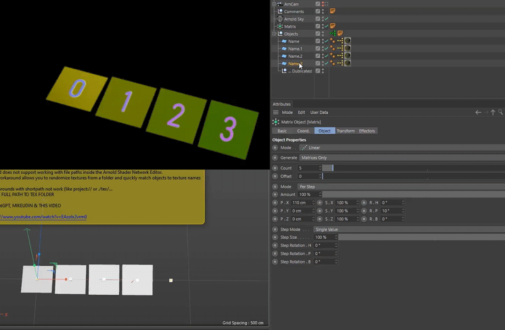

# scripts

Hey dudes. W*lcome [0]  > 🔹 [SCRIPT FOLDER](https://github.com/AleksandrovskyV/Cinema4D-Projects/tree/main/vsky.scripts)

---

## 🔹 [Fillet Plane](https://github.com/AleksandrovskyV/Cinema4D-Projects/blob/main/vsky.scripts/Filled%20Plane.py)  

  
  

<strong> Tested:</strong> R23 
"It`s a plane.. And it has fillets" 
  

## 🔹 [Matrix Preserve](https://github.com/AleksandrovskyV/Cinema4D-Projects/blob/main/vsky.scripts/Matrix%20Preserve.py)

  
  

<strong> Tested:</strong> R23 
Matrix Object to single mesh, color transfer to Vertex Color Tag AltMode: preserve as cubes, color transfer to object color 
  

 

## 🔹 [Object Color to Vertex Color Tag](https://github.com/AleksandrovskyV/Cinema4D-Projects/blob/main/vsky.scripts/Object%20Color%20to%20Vertex%20Color.py)  

  
  

<strong> Tested:</strong> R23 
Convert object color from polygon object to Vertex Color Tag  
  

 
 

## 🔹 [MP4 Vidoc](https://github.com/AleksandrovskyV/Cinema4D-Projects/blob/main/vsky.scripts/MP4%20Vidoc.py)  

  
  

<strong> Tested:</strong> R23 
[LMB] - render MP4 using current settings and _# numeration from PV 
[LMB]+[ALT] - viewport render from PV 
[LMB]+[SHIFT] - viewport render from BG
  

 

## 🔹 [Linked Camera](https://github.com/AleksandrovskyV/Cinema4D-Projects/blob/main/vsky.scripts/Linked%20Camera.py)  

  
  

<strong>Tested:</strong> R20+ 
> Instantly duplicates the active camera to the top level of your scene  
> Optionally adds a custom Xpresso setup with an Extend parameter to expand the render area while maintaining the original focal length  
  

 

- 🎯  Perfect for working with nested or heavy rigs — especially useful for baking or using scripts that require a standalone camera.
- 🧩 Automatically creates an extended render setting with sensor-based scaling, allowing for a wider frame — ideal for post-production workflows (e.g., After Effects)
- 🗑 One-click remove the generated camera, Xpresso tag, and render settings.

> *Additional note: by creating your own alpha-channel mask you can effectively “patch” the render in post. With the standard renderer, you achieve this by projecting a material that carries an alpha channel from the camera onto your scene. It’s a clever workaround—though I’m really hoping the Maxon team will one day build in a true “Negative Render Region” feature! :)*

# projects

Hey dudes. W*lcome [1]

---

## 🔹 [ARND_STRING_ATR_EXT](https://github.com/AleksandrovskyV/Cinema4D-Projects/tree/main/ARND_STRING_ATR_EXT)

> Extend workflow with Arnold String Attribute  
> _Based on [this method](https://www.youtube.com/watch?v=EAzoIx2vrm0)_

- 🎲 Randomizes Arnold textures from a selected folder  
- 🎯 Allows manual texture selection  

### 🏷 Tags

`cinema-4d` `c4d` `cinema-4d-script` `xpresso` `python` `expand-render-area` `camera-morph`  
`one-click-tools` `cg-tools` `extend-render-area`  `gpt-assisted`  `negative-render-region`  

<!-- SEO: cinema4d script camera morph xpresso python render region sensor size after effects aleksandrovsky -->
