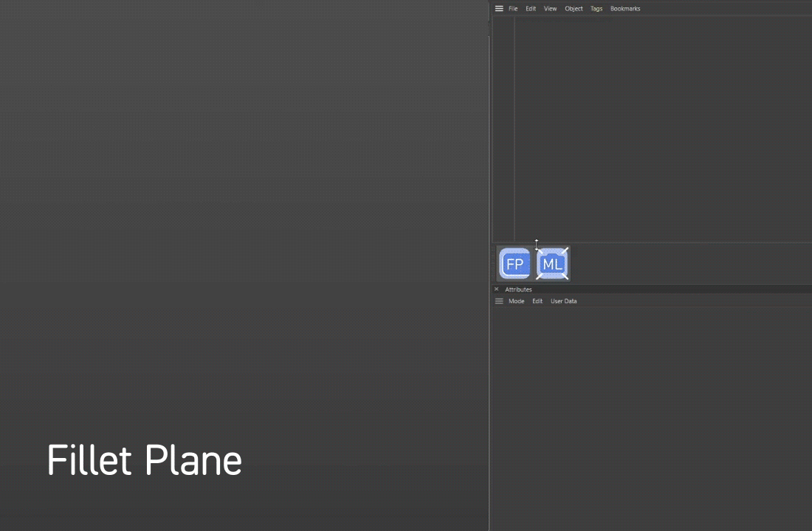
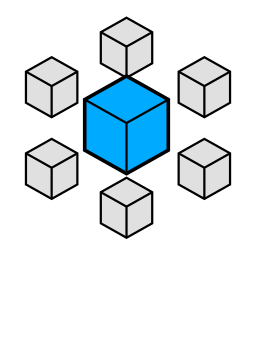
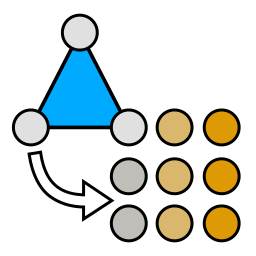
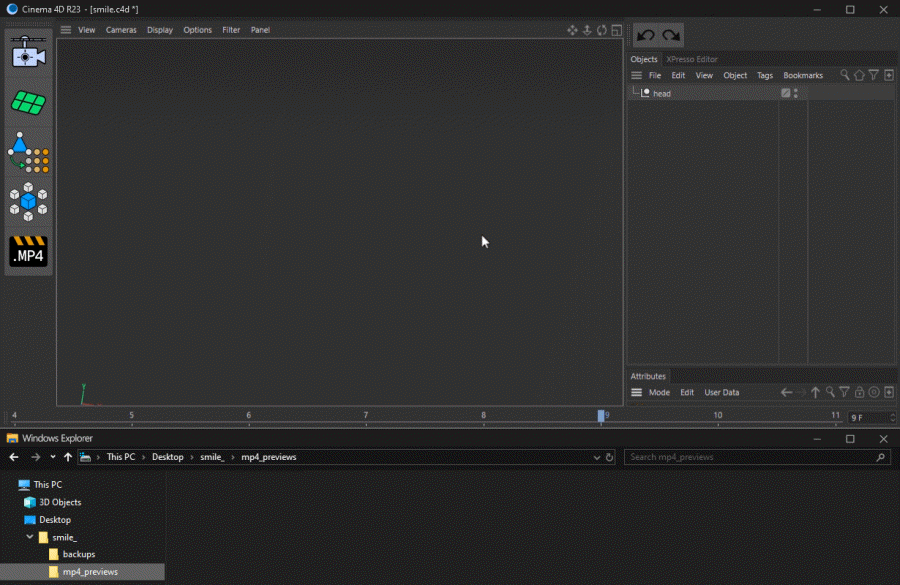
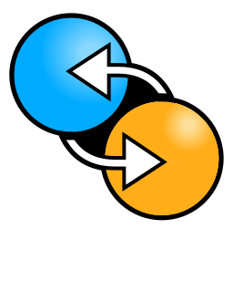
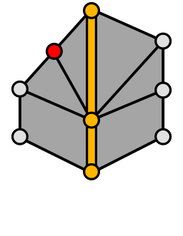
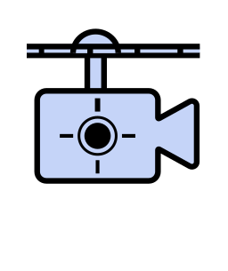
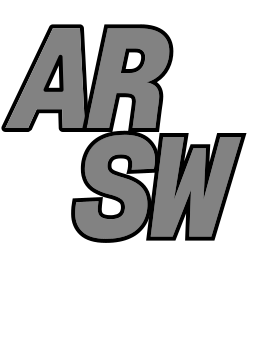
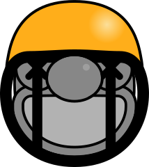

&nbsp;&nbsp;   
_* i say really,&nbsp;&nbsp;[github](https://github.com/AleksandrovskyV)_&nbsp;&nbsp;&nbsp;/&nbsp;&nbsp;_oh no,&nbsp;&nbsp;[pearl](https://AleksandrovskyV.github.io/c4d/pearl)_&nbsp;&nbsp;&nbsp;/&nbsp;&nbsp;_scroll to,&nbsp;&nbsp;[projects](#projects)_
   

# scripts

Hey dudes. W\*lcome [0]  > [DOWNLOAD SHELF](https://github.com/AleksandrovskyV/c4d/releases/download/v1.02/vsky_package.zip)
 

> если в России попробуй через vpn *\
> ссылки гитхаба ниже, вроде пока работают

  

## 🔹 [Fillet Plane](./vsky.scripts/Fillet%20Plane.py)  

<strong> Tested:</strong> R23 
<em>It`s a plane.. And it has fillets "</em>

 

  

## 🔹 [Matrix Preserve](./vsky.scripts/Matrix%20Preserve.py)

<strong> Tested:</strong> R23 
Matrix Object to single mesh, color transfer to Vertex Color Tag AltMode: preserve as cubes, color transfer to object color

 

## 🔹 [Object Color to Vertex Color Tag](./vsky.scripts/Object%20Color%20to%20Vertex%20Color.py)

<strong> Tested:</strong> R23 
Convert object color from polygon object to Vertex Color Tag

 

 

## 🔹 [MP4 Vidoc](./vsky.scripts/MP4%20Vidoc.py)  

<strong> Tested:</strong> R23 
A button to quickly export MP4 files with "_#" numbering 
using your current "Render Settings"

 

<strong>Controls:</strong> 
 [ LMB ] &nbsp;&nbsp;&nbsp;&nbsp;- &nbsp;&nbsp;Active settings via Picture Viewer 
 [ LMB + ALT ] &nbsp;&nbsp;&nbsp;- &nbsp;&nbsp;Viewport via Picture Viewer 
 [ LMB + SHIFT ] &nbsp;-&nbsp; Viewport via BG Process  

 

[extended](https://www.youtube.com/watch?v=ETzJl574FIY) *

 

## 🔹 [Swap Mats](./vsky.scripts/Swap%20Mats.py)  

<strong> Tested:</strong> R23 
Swap 2 selected texture tags in Object Manager

 

> * If select 2 objects, script swap last texture tags on objects 
> * If object has no tag, script scan children and find first object with tag for swap

  

## 🔹 [Mirror along Edge Loop](./vsky.scripts/Mirror%20along%20Edge%20Loop.py)  

<strong> Tested:</strong> R23 
Copies mesh point coordinates from one side to another. The edge/seam loop serves as the section plane. UV-Safe...

 

>A clone of the "Symmetrize" tool from Cinema 4D 2023+, which for some *mysterious reason* \
>refused to work with my geometry. Unfortunately, Google also failed to find any similar script\
>when I tried to search for one

[monolog](./monolog.md) *

  

## 🔹 [Globe Deformer](https://github.com/AleksandrovskyV/c4d/releases/download/v1.01/GlobeDeformer.zip)  

<strong> Tested:</strong> R19+ 
Wraps geometry into a Globe based on Equidistant/Mercator projections 
Includes a 2D mode for conversion between projections

 

>"Deformer Strength" slider from 1% to 99% in "2D Convert" mode has a slight precision error 
> However, it works fine at exact values of 0% and 100%  
> * The code is open, so feel free to fix it yourself)

  

## 🔹 [Print Alembic Paths](./vsky.scripts/_modules/Print%20Alembic%20Path.py)  

<strong> Tested:</strong> R23 
Console print selected Hierarchy. Houdini attribute mode display include...

 

  

## 🔹 [Connect Objects + Delete + Bake Mats Colors](./vsky.scripts/Connect%20Objects%20%2B%20Delete%20%2B%20Bake%20Mats%20Colors.py)  

<strong> Tested:</strong> R23 
Preserve Hierarchy to Single Mesh and 
Bake Luminance and Color Channel to Vertex Color Tags

 

  

## 🔹 [Linked Camera](./vsky.scripts/Linked%20Camera.py)  

<strong>Tested:</strong> R20+ 
Create a camera at the top level of your scene and linked to active one via Camera Morph Tag

 

> Xpresso Tag to expand "Render Area" with keep focal length ! [read](./readme/linked-camera.md) 

  

# projects

Hey dudes. W\*lcome [1] > [PROJECT FOLDER](https://github.com/AleksandrovskyV/c4d/tree/main/vsky.projects)
  

## 🔹 [Arnold Workflow "user_data_string"](https://raw.githubusercontent.com/AleksandrovskyV/c4d/main/vsky.projects/ar_workflow_user-data-string.zip)

<strong>Tested:</strong> ??  
- Randomizes textures from a folder 
- Manual replacement from an object

 

> How to use, please ! [read](./readme/c4dtoa-user-data-string.md)

  

## 🔹 [Test Smile](https://github.com/AleksandrovskyV/c4d/tree/main/vsky.projects)

  

<strong>Tested:</strong> ??  
Created to be tested...

 

 

Low-poly mouth with small trick * Pose Morph Tag&nbsp;&nbsp;>&nbsp;[download](https://raw.githubusercontent.com/AleksandrovskyV/c4d/main/vsky.projects/smile_std_rigged.zip?download=) 
Prepared Octane AOVs * with .aep files include&nbsp;&nbsp;>&nbsp;[download](https://raw.githubusercontent.com/AleksandrovskyV/c4d/main/vsky.projects/smile_octane_w_aep.zip?download=) 

    

# footer...
> Assembled by [AleksandrovskyV](https://github.com/AleksandrovskyV), with ai assistance... 
> Feel free to fork, break, or improve this 🔧  
> `c4d` `cinema-4d` `xpresso` `python` `ai` 
> `one-click-tools` `negative-render-region`

<!-- SEO: c4d-extend-render-area save-focal-length keep-focal-length c4dtoa-user-data-string c4dtoa-multishader c4dtoa-random-texture c4dtoa-randomize cinema-4d-button cinema-4d-scripts xpresso python vsky aleksandrovsky fillet-plane c4d-token-mp4 c4d-path-token c4d-token matrix-preserve matrix-bake c4d cinema4d cinema-4d -->