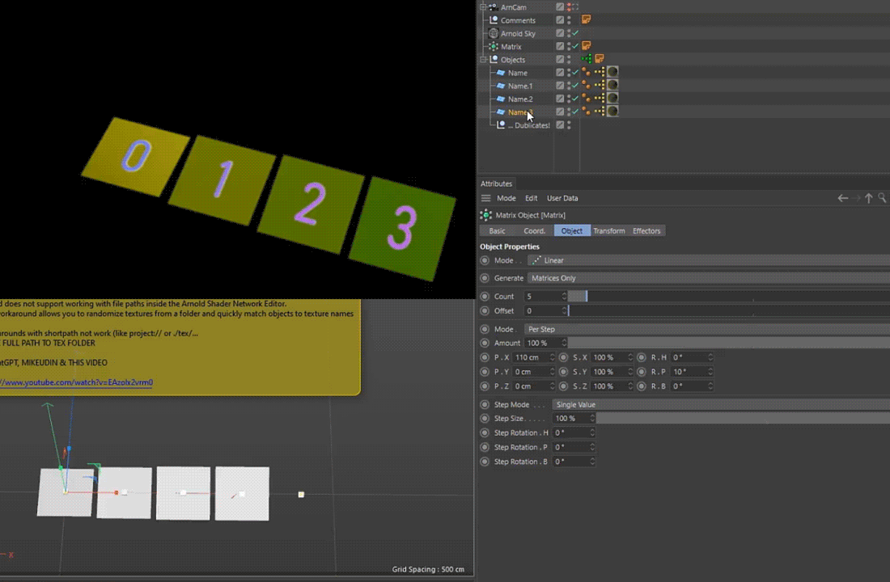

  

# Arnold Extend Workflow "user_data_string"

 

_Based on [this method](https://www.youtube.com/watch?v=EAzoIx2vrm0)_ - setup automates texture path assignment for **Arnold Render** in **Cinema 4D**, 
designed to streamline workflows with **Substance Painter** and batch texture assets 

_[youtube](https://www.youtube.com/watch?v=nXuQmZuPT0I) preview, workflow [download](https://raw.githubusercontent.com/AleksandrovskyV/c4d/main/vsky.projects/ar_workflow_user-data-string.7z
)_  

---
 

### Key Features
-  Random texture assignment for multiple clones or assets / meshes 
-  Random textures from a selected folder  
-  Allows manual selection of a specific texture via index
-  Quick material variations without duplicating shaders    
 

### How to Set Up
1. Create a new object  
2. Go to:  
   `User Data > Add User Data > Load Preset (ARND_STRING_ATR) > OK`  
3. Copy the **yellow Xpresso tag** from the provided example object  
4. Make sure your textures are named numerically (e.g. `BaseColor_01.jpg`, `BaseColor_02.jpg`)

 

Tip: Use **Adobe Bridge** or [similar](https://AleksandrovskyV.github.io/python/) tools for batch renaming

   

---
 

> Assembled by [AleksandrovskyV](https://github.com/AleksandrovskyV), with assistance from ChatGPT 
> Feel free to fork, break, or improve this setup 🔧  
>`c4dtoa` `c4d arnold render` `multi-shader-arnold` `user_data_string-random`
`random-textures-from-folder-in-arnold-shader`  `aleksandrovsky` & `gpt-assisted`